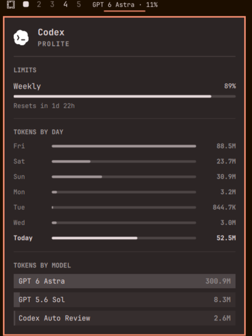

# OmaGoblin

**Your tokens. My precious.**

An AI usage widget made for Omarchy. Keep an eye on subscription limits, reset times and token consumption from the desktop bar.

Derived from Omarchy's `omarchy.agents` widget, with a compact bar label showing the most recently recorded Codex model and remaining allowance. The popup supports Claude, Codex and Fireworks records supplied by Omarchy.

<p align="center">
  
</p>

## Features

- Subscription usage meters and time until quota resets.
- Daily and per-model token statistics.
- Prepaid balance when the collector supplies one; estimated balances remain labeled as estimates.
- Optional usage aggregation through a folder you sync between devices.
- Left-click opens the panel, middle-click switches subscriptions, right-click launches Omarchy's agent picker.

The bar label is Codex-focused. The displayed model comes from the latest modified local Codex session and can be stale after switching tools. Remaining quota is based on the limit window selected by the widget, not a monetary balance. With no recorded usage, the widget hides itself.

## Requirements

- Omarchy with the Quickshell plugin system and `omarchy-agent-usage-update` (packaging validated against Omarchy 4.0.4-1).
- Omarchy's `qs.Commons` and `qs.Ui` components and agent collectors.
- Bash, jq and GNU findutils/coreutils.
- A supported agent installed and authenticated separately to retrieve its account limits.

This is an Omarchy plugin, not a standalone Quickshell configuration. Collectors and authentication tools are not bundled. Older Omarchy versions without these APIs are not supported.

## Install

```bash
omarchy plugin add https://github.com/Gianclaudio81/omagoblin.git --enable
```

The plugin ID is `tod.omagoblin`. You can position it explicitly:

```bash
omarchy bar move tod.omagoblin --section left
```

If you already use another agents widget, disable it to avoid duplicate panels and refresh timers:

```bash
omarchy plugin disable omarchy.agents
# For a personal clone named tod.agents, disable that ID instead.
```

Update or disable:

```bash
omarchy plugin update tod.omagoblin
omarchy plugin disable tod.omagoblin
```

## Remove

```bash
omarchy plugin remove tod.omagoblin
```

Omarchy asks for confirmation before removing the installed plugin. Shared agent usage records and any external sync snapshots are not deleted by this plugin.

## Settings

```bash
omarchy bar set tod.omagoblin refreshIntervalSec 300 --json
omarchy bar set tod.omagoblin providers '{"claude":{"enabled":true},"codex":{"enabled":true},"fireworks":{"enabled":false}}' --json
```

Refresh defaults to 900 seconds. Provider settings belong to the widget entry in Omarchy's `shell.json`; providers default to enabled. No personal settings file is distributed.

Optional cross-device aggregation:

```bash
omarchy bar set tod.omagoblin syncDir '~/Sync/agent-usage'
omarchy bar set tod.omagoblin syncMode On
```

You provide the synchronization service. Snapshots contain usage statistics and device identifiers: keep that folder private and outside this repository. Rate limits remain per-account and are not added across devices. Disable aggregation with `syncMode Off`.

## Controls

Inside the panel: `h` / `l` switch subscription, `j` / `k` scroll, `r` or Enter refresh, Esc closes.

```bash
omarchy-shell tod.omagoblin toggle
omarchy-shell tod.omagoblin refresh
```

Other IPC actions: `open`, `close`, `show`, `hide`, `next`.

## Data and privacy

The widget reads collector-generated JSON from `${XDG_STATE_HOME:-$HOME/.local/state}/omarchy/agents/usage`. Collectors run through Omarchy and may contact the corresponding provider using locally configured authentication. Usage availability and historical coverage depend on those collectors.

`active-model.sh` reads only the model field from the newest modified Codex session under `${CODEX_HOME:-$HOME/.codex}/sessions`. It does not copy session transcripts into the repository or publish them.

OmaGoblin has no telemetry endpoint. Optional synchronization writes usage snapshots to the directory you configure. Never commit credentials, session files or usage snapshots.

## Development

```bash
omarchy plugin validate .
bash -n active-model.sh
```

The plugin relies on the host Omarchy shell for QML imports. A generic QML linter without those modules cannot validate the full runtime.

## Credits and license

Based on the [Omarchy](https://github.com/basecamp/omarchy) agents widget. The original MIT copyright notice is preserved in [LICENSE](LICENSE); OmaGoblin modifications are also MIT licensed.

Provider SVG assets are inherited from the original widget. Provider names and logos identify their respective services and remain the property of their owners. OmaGoblin is an independent community plugin.
