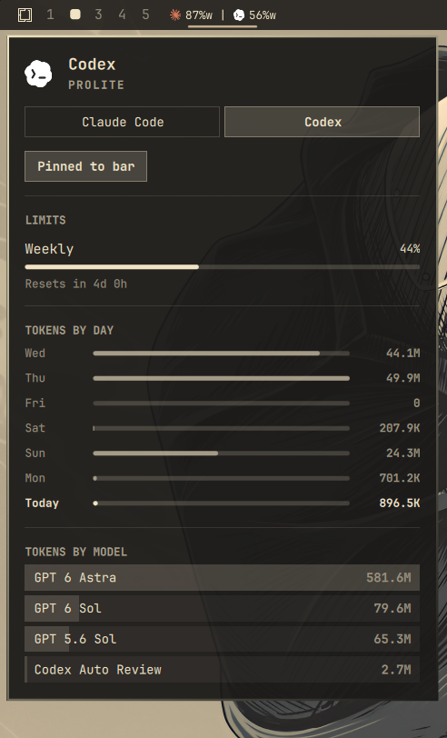
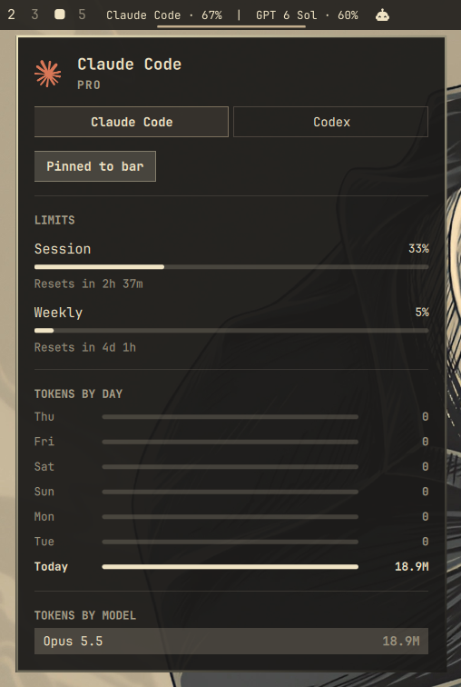
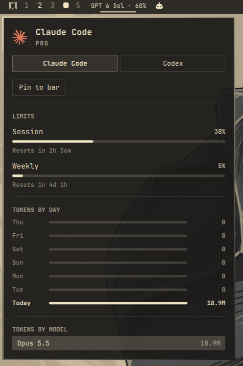

# OmaGoblin

**Your tokens. My precious.**

An AI usage widget made for Omarchy. Keep an eye on subscription limits, reset times and token consumption from the desktop bar.

Derived from Omarchy's `omarchy.agents` widget. The bar can show one or several provider summaries, while the popup shows any provider record supplied by Omarchy.

<p align="center">
  
</p>

<p align="center">
  
  
</p>

## Features

- Subscription usage meters and time until quota resets.
- Daily and per-model token statistics.
- Prepaid balance when the collector supplies one; estimated balances remain labeled as estimates.
- Optional usage aggregation through a folder you sync between devices.
- Pin one or several detected providers to the bar from the popup.
- Left-click opens the panel, middle-click switches subscriptions, right-click launches Omarchy's agent picker.

The bar defaults to Codex when its data is available. The bar shows only the remaining percentage of the current session for each pinned provider; plans without any session window (such as Codex Pro Lite) show the weekly remainder with a `w` suffix, while a session quota that is temporarily missing appears as an em dash. Weekly limits, names, balances and token totals remain in the popup. If a pinned provider has no data, the bar shows the other pinned providers; if none has data, it shows the first available provider. With no recorded usage, the widget hides itself.

## Requirements

- Omarchy with the Quickshell plugin system and `omarchy-agent-usage-update` (packaging validated against Omarchy 4.0.4-1).
- Omarchy's `qs.Commons` and `qs.Ui` components and agent collectors.
- Bash, Python 3, jq and GNU findutils/coreutils.
- A supported agent installed and authenticated separately to retrieve its account limits.

This is an Omarchy plugin, not a standalone Quickshell configuration. The Claude adapter reuses the installed Python collector and its internal collection/cache functions (validated against Omarchy 4.0.4-1); compatibility may need updating if those internals change. Collectors and authentication tools are not bundled. Older Omarchy versions without these APIs are not supported.

## Install

```bash
omarchy plugin add https://github.com/Gianclaudio81/omagoblin.git --enable
```

The plugin ID is `tod.omagoblin`. You can position it explicitly:

```bash
omarchy bar move tod.omagoblin --section left
```

If you already use another agents widget, disable it to avoid duplicate panels and refresh timers:

```bash
omarchy plugin disable omarchy.agents
# For a personal clone named tod.agents, disable that ID instead.
```

Update or disable:

```bash
omarchy plugin update tod.omagoblin
omarchy plugin disable tod.omagoblin
```

## Remove

```bash
omarchy plugin remove tod.omagoblin
```

Omarchy asks for confirmation before removing the installed plugin. Shared agent usage records and any external sync snapshots are not deleted by this plugin.

## Settings

```bash
omarchy bar set tod.omagoblin refreshIntervalSec 120 --json
omarchy bar set tod.omagoblin barProviders 'codex,claude'
omarchy bar set tod.omagoblin providers '{"claude":{"enabled":true},"codex":{"enabled":true},"fireworks":{"enabled":false}}' --json
```

`barProviders` takes comma-separated provider IDs in display order. The popup's **Pin to bar** button saves the same setting, so you can select Codex, Claude, both, or any other provider that Omarchy discovers (such as Grok or Gemini). At least one provider stays pinned. Refresh defaults to 120 seconds. Claude uses the host collector through a local adapter: rate-limited probes back off from five to thirty minutes and cached values are explicitly marked as outdated in the popup. Codex also runs through a local adapter that reads the app-server replies without losing buffered lines, so limits no longer drop out intermittently. Missing subscription limits are retried automatically after 30 seconds, with backoff up to two minutes. Local records are re-read every 30 seconds. Provider settings belong to the widget entry in Omarchy's `shell.json`; providers default to enabled. No personal settings file is distributed.

Optional cross-device aggregation:

```bash
omarchy bar set tod.omagoblin syncDir '~/Sync/agent-usage'
omarchy bar set tod.omagoblin syncMode On
```

You provide the synchronization service. Snapshots contain usage statistics and device identifiers: keep that folder private and outside this repository. Rate limits remain per-account and are not added across devices. Disable aggregation with `syncMode Off`.

The sync reader treats snapshots as untrusted. Each scan examines at most 1,024
entries and 64 JSON candidates, reads at most 256 KiB per file and 2 MiB total,
and emits at most 2 MiB to the shell. Symlinks and non-regular files are rejected,
including replacements between inspection and opening. JSON is limited to 12
levels, 4,096 items per container, 32 providers per snapshot, 8,192 values per
snapshot and 32,768 values per scan; strings and keys are also bounded. Invalid
or excess snapshots are skipped and the panel shows a warning. Use a dedicated
sync folder: excess files can make the aggregate incomplete. The helper has a
five-second timeout; failed scans retain the last successful aggregate.

Local usage records are read the same way. A helper opens the usage directory
without following symlinks and accepts only regular `.json` files owned by the
current user, at most 32 records of 256 KiB each (1 MiB total), opened with
`O_NOFOLLOW | O_NONBLOCK` so a swapped symlink or FIFO cannot stall the shell.
Records are limited to 12 levels and 16,384 values; invalid ones are skipped.
The helper has a five-second timeout; failed reads keep the last records.

This machine's snapshot is published by a helper too, because other machines
write to the same folder and could leave a symlink or FIFO under its name. The
snapshot reaches the helper through its environment (readable only by you, not
through the process list), is limited to 256 KiB, and is written to a new
owner-only temporary file that atomically replaces the directory entry, so a
planted link is replaced rather than written through. The Claude adapter stops
after 45 seconds, `active-model.sh` bounds its reads and output, and collector
error output kept by the shell is capped at 16 KiB.

## Controls

Inside the panel: `h` / `l` switch subscription, `j` / `k` scroll, `r` or Enter refresh, Esc closes.

```bash
omarchy-shell tod.omagoblin toggle
omarchy-shell tod.omagoblin refresh
```

Other IPC actions: `open`, `close`, `show`, `hide`, `next`.

## Data and privacy

The widget reads collector-generated JSON from `${XDG_STATE_HOME:-$HOME/.local/state}/omarchy/agents/usage`. Collectors run through Omarchy and may contact the corresponding provider using locally configured authentication. Usage availability and historical coverage depend on those collectors. `refresh-claude.py` executes the installed Omarchy Claude collector in-process, using its existing authentication and endpoint, and atomically writes the Claude usage record. It stores only retry timing and status text in `${XDG_CACHE_HOME:-$HOME/.cache}/omarchy/agent-usage/omagoblin-claude-backoff.json`; no tokens or credentials are stored in this additional cache. `refresh-codex.py` likewise executes the installed Omarchy Codex collector in-process, replacing only its app-server line reader, and atomically writes the Codex usage record; it stores nothing extra.

`active-model.sh` reads only the model field from the newest modified Codex session under `${CODEX_HOME:-$HOME/.codex}/sessions`. It does not copy session transcripts into the repository or publish them.

OmaGoblin has no telemetry endpoint. Optional synchronization writes usage snapshots to the directory you configure. Never commit credentials, session files or usage snapshots.

## Development

```bash
omarchy plugin validate .
bash -n active-model.sh update-usage.sh
python3 -m unittest discover -s tests -v
node --test tests/*.test.cjs
```

The plugin relies on the host Omarchy shell for QML imports. A generic QML linter without those modules cannot validate the full runtime.

## Credits and license

Based on the [Omarchy](https://github.com/basecamp/omarchy) agents widget. The original MIT copyright notice is preserved in [LICENSE](LICENSE); OmaGoblin modifications are also MIT licensed.

Provider SVG assets are inherited from the original widget. Provider names and logos identify their respective services and remain the property of their owners. OmaGoblin is an independent community plugin.
